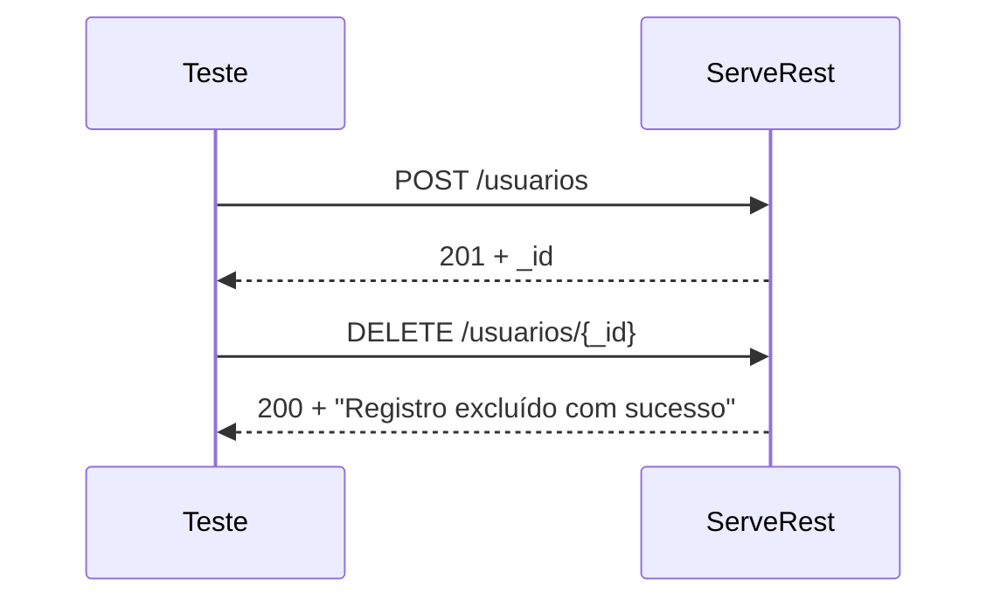

# Fluxo DELETE:

1. Criar um usuário.
2. Capturar o `_id` retornado.
3. Excluir o usuário usando esse `_id`.
4. Validar que a exclusão foi realizada com sucesso.

## Cenário (BDD)

```gherkin
Feature: Exclusão de usuários

  Scenario: Excluir um usuário existente
    Given que um usuário foi cadastrado na aplicação
    When uma requisição DELETE é enviada para "/usuarios/{id}"
    Then a API deve retornar o status 200
    And deve retornar a mensagem "Registro excluído com sucesso"
```

---

## Implementação com Rest Assured

```java
package usuarios;

import io.restassured.RestAssured;
import io.restassured.http.ContentType;
import model.Usuario;
import org.junit.jupiter.api.BeforeAll;
import org.junit.jupiter.api.Test;

import static io.restassured.RestAssured.given;
import static org.hamcrest.Matchers.equalTo;
import static org.hamcrest.Matchers.notNullValue;

public class ExcluirUsuarioTest {

    @BeforeAll
    static void setup() {
        RestAssured.baseURI = "https://serverest.dev";
    }

    @Test
    void deveExcluirUsuarioComSucesso() {

        // Arrange
        String email = "usuario" + System.currentTimeMillis() + "@email.com";

        Usuario usuario = new Usuario();
        usuario.setNome("João Silva");
        usuario.setEmail(email);
        usuario.setPassword("123456");
        usuario.setAdministrador("true");

        // Cria o usuário e captura o ID
        String idUsuario =
            given()
                .contentType(ContentType.JSON)
                .body(usuario)
            .when()
                .post("/usuarios")
            .then()
                .statusCode(201)
                .body("message", equalTo("Cadastro realizado com sucesso"))
                .extract()
                .path("_id");

        // Act + Assert
        given()
        .when()
            .delete("/usuarios/" + idUsuario)
        .then()
            .statusCode(200)
            .body("message", equalTo("Registro excluído com sucesso"));
    }
}
```

## O que esse teste faz



## Uma validação extra (recomendada)

Depois de excluir o usuário, você pode verificar se ele realmente não existe mais:

```java
given()
.when()
    .get("/usuarios/" + idUsuario)
.then()
    .statusCode(400)
    .body("message", equalTo("Usuário não encontrado"));
```

Assim, o teste valida não apenas a resposta do `DELETE`, mas também o efeito esperado da operação, aumentando a confiança de que a exclusão foi realmente realizada.
