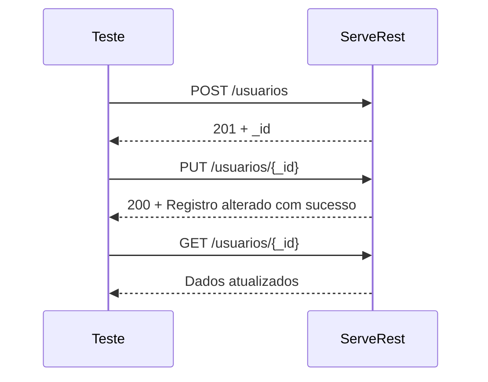

# Fluxo UPDATE

O fluxo de **UPDATE** segue o mesmo princípio dos demais testes: primeiro você prepara os dados (cria o usuário), depois executa a ação (atualiza o usuário) e, por fim, valida o resultado.

## Cenário (BDD)

```gherkin
Feature: Atualização de usuários

  Scenario: Atualizar um usuário existente
    Given que um usuário foi cadastrado
    When uma requisição PUT é enviada para "/usuarios/{id}" com novos dados
    Then a API deve retornar o status 200
    And deve retornar a mensagem "Registro alterado com sucesso"
```

---

## Fluxo



---

## Implementação com Rest Assured

```java
package usuarios;

import io.restassured.RestAssured;
import io.restassured.http.ContentType;
import model.Usuario;
import org.junit.jupiter.api.BeforeAll;
import org.junit.jupiter.api.Test;

import static io.restassured.RestAssured.given;
import static org.hamcrest.Matchers.equalTo;

public class AtualizarUsuarioTest {

    @BeforeAll
    static void setup() {
        RestAssured.baseURI = "https://serverest.dev";
    }

    @Test
    void deveAtualizarUsuarioComSucesso() {

        // Arrange
        String email = "usuario" + System.currentTimeMillis() + "@email.com";

        Usuario usuario = new Usuario();
        usuario.setNome("João Silva");
        usuario.setEmail(email);
        usuario.setPassword("123456");
        usuario.setAdministrador("true");

        // Cria o usuário
        String idUsuario =
            given()
                .contentType(ContentType.JSON)
                .body(usuario)
            .when()
                .post("/usuarios")
            .then()
                .statusCode(201)
                .extract()
                .path("_id");

        // Atualiza os dados
        usuario.setNome("João Silva Atualizado");
        usuario.setPassword("654321");

        // Act + Assert
        given()
            .contentType(ContentType.JSON)
            .body(usuario)
        .when()
            .put("/usuarios/" + idUsuario)
        .then()
            .statusCode(200)
            .body("message", equalTo("Registro alterado com sucesso"));

        // Validação adicional
        given()
        .when()
            .get("/usuarios/" + idUsuario)
        .then()
            .statusCode(200)
            .body("nome", equalTo("João Silva Atualizado"))
            .body("email", equalTo(email))
            .body("administrador", equalTo("true"));
    }
}
```

---

## O que esse teste valida

* ✅ O usuário foi criado com sucesso.
* ✅ O `PUT /usuarios/{id}` retornou **HTTP 200**.
* ✅ A mensagem retornada foi **"Registro alterado com sucesso"**.
* ✅ Os dados realmente foram alterados, confirmando com um **GET**.

### Boas práticas

Para evitar repetição entre os testes de **Criar**, **Atualizar**, **Excluir** e **Login**, considere criar um método auxiliar para cadastrar um usuário e retornar o seu ID:

```java
String idUsuario = UsuarioService.criarUsuario();
```

Ou uma fábrica de dados:

```java
Usuario usuario = UsuarioFactory.criarUsuario();
```

Dessa forma, seus testes ficam focados apenas no comportamento que desejam validar, enquanto a criação dos dados de teste fica centralizada e reutilizável.
